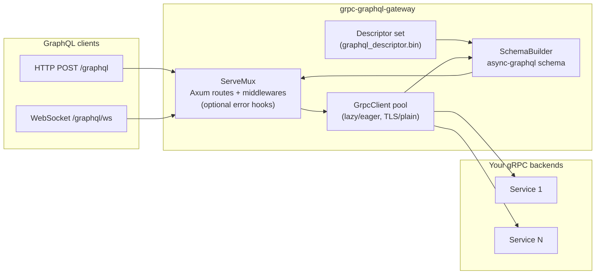

# grpc-graphql-gateway-rs

Bridge your gRPC services to GraphQL. This crate builds an `async-graphql` schema directly from protobuf descriptors (including custom `(graphql.*)` options) and routes requests to your gRPC backends via `tonic`.

## Highlights
- GraphQL **queries**, **mutations**, and **subscriptions** from gRPC methods (unary + server streaming)
- Dynamic schema generation from descriptor sets; optional pluck/rename/omit field directives
- Lazy or eager TLS/plain gRPC clients via a small builder API
- Axum HTTP + WebSocket (graphql-ws) integration out of the box
- Middleware and error-hook support for auth/logging/observability
- `protoc-gen-graphql-template` helper that emits a starter gateway file and prints example operations

## Install
```toml
[dependencies]
grpc-graphql-gateway = "0.1"
tokio = { version = "1", features = ["full"] }
tonic = "0.12"
```

## Generate descriptors
Use `tonic-build` (already wired in `build.rs`) to emit `graphql_descriptor.bin`:
```rust
fn main() -> Result<(), Box<dyn std::error::Error>> {
    println!("cargo:rerun-if-changed=proto/graphql.proto");
    let out_dir = std::env::var("OUT_DIR")?;
    let proto_include = std::env::var("PROTOC_INCLUDE").unwrap_or_else(|_| "/usr/local/include".to_string());

    tonic_build::configure()
        .build_server(false)
        .build_client(false)
        .file_descriptor_set_path(std::path::PathBuf::from(&out_dir).join("graphql_descriptor.bin"))
        .compile_protos(&["proto/graphql.proto"], &["proto", &proto_include])?;
    Ok(())
}
```

## Quick start
```rust
use grpc_graphql_gateway::{Gateway, GrpcClient, Result};

const DESCRIPTORS: &[u8] = include_bytes!(concat!(env!("OUT_DIR"), "/graphql_descriptor.bin"));

#[tokio::main]
async fn main() -> Result<()> {
    let builder = Gateway::builder()
        .with_descriptor_set_bytes(DESCRIPTORS)
        .add_grpc_client(
            "greeter.Greeter",
            GrpcClient::builder("http://127.0.0.1:50051").lazy(true).connect_lazy()?,
        );

    builder.serve("0.0.0.0:8888").await
}
```
- HTTP GraphQL endpoint: `POST /graphql`
- WebSocket subscriptions: `GET /graphql/ws` (graphql-ws)

### Built-in greeter example
The repository ships a runnable greeter service defined in `proto/greeter.proto` that exercises queries, mutations, subscriptions, and a resolver. Run both the gRPC backend and the GraphQL gateway (this is the default `cargo run` target):
```bash
cargo run            # or: cargo run --bin greeter
```
gRPC listens on `127.0.0.1:50051`, and GraphQL (HTTP + websocket) is at `http://127.0.0.1:8888/graphql` (`ws://127.0.0.1:8888/graphql/ws` for subscriptions).

Sample operations you can paste into GraphiQL or curl:
```graphql
query { hello(name: "GraphQL") { message meta { correlationId from { id displayName trusted } } } }
mutation { updateGreeting(input: { name: "GraphQL", salutation: "Howdy" }) { message } }
subscription { streamHello(name: "GraphQL") { message meta { correlationId } } }
query { user(id: "demo") { id displayName trusted } }
```

Upload mutation (uses the GraphQL `Upload` scalar; send as multipart):
```graphql
mutation ($file: Upload!) {
  uploadAvatar(input: { userId: "demo", avatar: $file }) { userId size }
}
```
```
curl http://127.0.0.1:8888/graphql \
  --form 'operations={ "query": "mutation ($file: Upload!) { uploadAvatar(input:{ userId:\"demo\", avatar:$file }) { userId size } }", "variables": { "file": null } }' \
  --form 'map={ "0": ["variables.file"] }' \
  --form '0=@./proto/greeter.proto;type=application/octet-stream'
```

Multi-upload mutation (list of `Upload`):
```graphql
mutation ($files: [Upload!]!) {
  uploadAvatars(input: { userId: "demo", avatars: $files }) { userId sizes }
}
```
```
curl http://127.0.0.1:8888/graphql \
  --form 'operations={ "query": "mutation ($files: [Upload!]!) { uploadAvatars(input:{ userId:\"demo\", avatars:$files }) { userId sizes } }", "variables": { "files": [null, null] } }' \
  --form 'map={ "0": ["variables.files.0"], "1": ["variables.files.1"] }' \
  --form '0=@./proto/greeter.proto;type=application/octet-stream' \
  --form '1=@./README.md;type=text/plain'
```

## How it fits together
A quick view of how protobuf descriptors, the generated schema, and gRPC clients are wired to serve GraphQL over HTTP and WebSocket:


## Proto annotations (from `proto/graphql.proto`)
- Service defaults:
  ```proto
  service Greeter {
    option (graphql.service) = { host: "127.0.0.1:50051", insecure: true };
    rpc SayHello(HelloRequest) returns (HelloReply) {
      option (graphql.schema) = { type: QUERY, name: "hello" };
    }
  }
  ```
- Method options (`graphql.schema`):
  - `type`: QUERY | MUTATION | SUBSCRIPTION | RESOLVER
  - `name`: override GraphQL field name
  - `request.name`: wrap input as a single argument
  - `response.pluck`: expose a nested field instead of the whole message
  - `response.required`: mark return type non-null
- Field options (`graphql.field`):
  - `required`: non-null in GraphQL
  - `name`: rename field
  - `omit`: skip field entirely

## Using the template generator
`protoc-gen-graphql-template` emits a ready-to-run `graphql_gateway.rs` that wires clients, logs discovered operations, and prints example queries/mutations/subscriptions.
```bash
protoc \
  --plugin=protoc-gen-graphql-template=target/debug/protoc-gen-graphql-template \
  --graphql-template_out=. \
  --proto_path=proto \
  your_service.proto
```
Open the generated file, point endpoints at your services, and run it.

### Example: Greeter
```bash
cargo build --bin protoc-gen-graphql-template

protoc \
  --plugin=protoc-gen-graphql-template=target/debug/protoc-gen-graphql-template \
  --graphql-template_out=./generated \
  --proto_path=proto \
  proto/greeter.proto

rustc ./generated/graphql_gateway.rs -L target/debug/deps
./graphql_gateway
```
The generated gateway will log which queries/mutations/subscriptions it found and print example GraphQL operations such as:
```
Example queries:
  query { hello }
Example mutations:
  mutation { createUser }
Example subscriptions:
  subscription { streamHello }
```

## Middleware and error hooks
Attach middlewares and inspect errors:
```rust
use grpc_graphql_gateway::{Gateway, GrpcClient};
use grpc_graphql_gateway::middleware::LoggingMiddleware;

let builder = Gateway::builder()
    .with_descriptor_set_bytes(DESCRIPTORS)
    .add_grpc_client("service", GrpcClient::builder("http://localhost:50051").connect_lazy()?)
    .add_middleware(LoggingMiddleware);
```
`GatewayBuilder::with_error_handler` lets you capture `GraphQLError`s before responses are returned.

## Type mapping (protobuf -> GraphQL)
- `string` -> `String`
- `bool` -> `Boolean`
- `int32`/`uint32` -> `Int`
- `int64`/`uint64` -> `String` (to avoid precision loss)
- `float`/`double` -> `Float`
- `bytes` -> `Upload` (inputs via multipart) / `String` (base64 responses)
- `repeated` -> `[T]`
- `message` -> `Object` / `InputObject`
- `enum` -> `Enum`

`Upload` inputs follow the GraphQL multipart request spec and are valid on mutations.

## GraphQL Federation

This gateway supports [Apollo Federation v2](https://www.apollographql.com/docs/federation/), enabling you to compose multiple GraphQL services into a unified supergraph.

### Enabling Federation

Enable federation support when building your gateway:

```rust
let gateway = Gateway::builder()
    .with_descriptor_set_bytes(DESCRIPTORS)
    .enable_federation()  // Enable federation support
    .add_grpc_client("service", client)
    .build()?;
```

### Defining Entities

Mark protobuf messages as federated entities using the `graphql.entity` option:

```protobuf
message User {
  option (graphql.entity) = {
    keys: "id"              // Primary key field
    resolvable: true        // This service can resolve this entity
  };
  
  string id = 1 [(graphql.field) = { required: true }];
  string email = 2;
  string name = 3;
}
```

**Multiple Keys**: Support composite keys and multiple key definitions:
```protobuf
message Product {
  option (graphql.entity) = {
    keys: "upc"           // Single field key
    keys: "sku type"      // Composite key (multiple fields)
  };
  
  string upc = 1;
  string sku = 2;
  string type = 3;
}
```

### Extending Entities

Extend entities from other services using `extend: true`:

```protobuf
message UserExtension {
  option (graphql.entity) = {
    extend: true          // This extends User from another service
    keys: "id"
  };
  
  string id = 1 [(graphql.field) = { 
    external: true        // This field is defined in another service
    required: true 
  }];
  
  repeated Review reviews = 2 [(graphql.field) = {
    requires: "id"        // This field requires `id` from the base entity
  }];
}
```

### Field-Level Federation Directives

#### `@external`
Mark fields that are defined in another service:
```protobuf
string user_id = 1 [(graphql.field) = { external: true }];
```

#### `@requires`
Specify fields needed from other services to resolve this field:
```protobuf
int32 total_reviews = 2 [(graphql.field) = { requires: "id email" }];
```

#### `@provides`
Indicate which fields this field provides to the supergraph:
```protobuf
User author = 3 [(graphql.field) = { provides: "id name" }];
```

### Entity Resolution

When federation is enabled and entities are defined, the gateway automatically exposes the `_entities` query for entity resolution. The current implementation returns entity representations as-is; for production use, implement a custom `EntityResolver`:

```rust
use grpc_graphql_gateway::{EntityResolver, FederationConfig};

struct MyEntityResolver {
    // Your gRPC clients or other resolution logic
}

#[async_trait::async_trait]
impl EntityResolver for MyEntityResolver {
    async fn resolve_entity(
        &self,
        entity_config: &EntityConfig,
        representation: &IndexMap<Name, Value>,
    ) -> Result<Value> {
        // 1. Extract key fields from representation
        // 2. Call appropriate gRPC service
        // 3. Return resolved entity
        todo!("Implement entity resolution")
    }
}
```

### Federation Schema Features

When federation is enabled, the gateway automatically:
- ✅ Adds `@key` directives to entity types
- ✅ Adds `@extends` directive to entity extensions
- ✅ Adds `@external`, `@requires`, `@provides` directives to fields
- ✅ Exposes `_entities(representations: [_Any!]!)` query
- ✅ Exposes `_service { sdl }` query (via async-graphql)
- ✅ Registers entity types in the `_Entity` union

### Example: Federated Microservices

See `proto/federation_example.proto` for a complete example showing:
- User service (defines the User entity)
- Product service (defines Product entity, references User)
- Review service (extends both User and Product entities)

Each service can be deployed independently while participating in a unified federated graph.

### Federation Best Practices

1. **Define clear entity boundaries**: Each service should own its entities
2. **Use composite keys when needed**: For entities with multiple identifying fields
3. **Mark external fields correctly**: Avoid duplicating field resolution logic
4. **Use `@provides` sparingly**: Only when you're returning partial entities
5. **Keep `@requires` minimal**: Only specify fields you actually need


## Development
- Format: `cargo fmt`
- Lint/tests: `cargo test`
- A runnable example lives at `examples/greeter`, wired up to `proto/greeter.proto` (query/mutation/subscription/resolver).

## License
MIT. See [LICENSE](./LICENSE).
